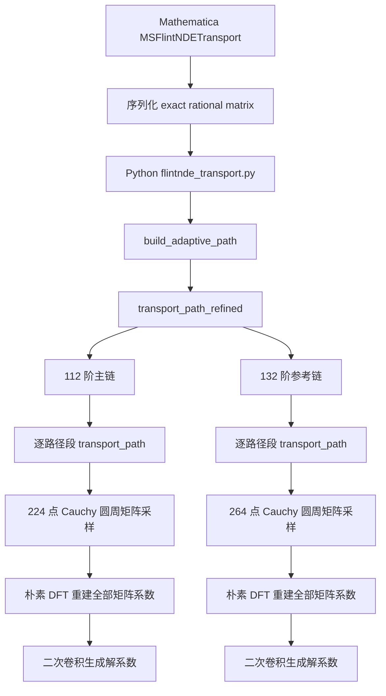

# MadStree v0.6 输运性能问题报告

- 问题编号：`MDS-PERF-2026-08-09`
- 报告日期：2026-08-09
- 状态：已定位主要瓶颈，尚未修改生产代码
- 严重程度：高（数值正确，但单点和多点输运时间明显偏长）
- 审计对象：`dSIBP-development/package-MadStree/versions/MadStree-v0.6`
- MadStree 仓库版本：`0fe8900c103d835999bea5292d515026711d39d3`

## 1. 结论摘要

MadStree 当前计算慢，主要不是 Mathematica 外壳、Python 启动、JSON 文件或硬件异常造成的，而是数值后端的算法和多点接口语义造成的。

已经由代码和实测确认的主要原因如下。

1. **每一个普通输运小段都用通用 Cauchy–DFT 方法重建整套稠密矩阵泰勒系数。** 112 阶主链默认在复圆周上计算 224 个完整矩阵，再用双重循环重建 112 个矩阵系数。单段剖析显示，这一步占单段总时间约 **94.5%**。
2. **`FlintNDESavePoints` 被转换成 `detour_points`，每个输出点都变成实际路径节点。** 这不是真正的 dense output。80 点扫描从自然路径的 12 段增加到 79 段，每一小段仍支付完整的 112/132 阶泰勒构造成本。
3. **精度认证会完整计算两条输运链。** 当前代码先跑 112 阶主链，再从头跑 132 阶参考链。完整单点中，主链为 241.18 s，参考链额外需要 297.57 s。
4. **完整物理量的四个独立 Schwinger–Keldysh 分支串行运行。** 当前基准依次运行 `ppp`、`ppm`、`pmp`、`mpp`，未使用显式并行。
5. **通用矩阵求值存在大量 Python 对象和精确数到 `acb` 的重复转换。** 20 维 `ppm` 单段产生约 674 万次 Python 调用；224 个采样点会对 400 个矩阵元做 89,600 次有理函数求值，其中该测试矩阵只有 104 个非零元。

因此，这不是“输运方法本身一定比级数慢”，而是当前 MadStree/FlintNDE 的通用实现没有利用该 dlog 系统已有的简单极点–留数结构，也没有为多点扫描缓存和复用局部解系数。

## 2. 审计范围和科学对象

本报告检查的是三顶点、两条 massive internal exchange 的完整物理 `Top0000` 相关函数。层级和维数为：

| 分支 | 活跃维数 |
| --- | ---: |
| `ppp` | 25 |
| `ppm` | 20 |
| `pmp` | 16 |
| `mpp` | 20 |

四个独立分支和它们的共轭共同构成八个 SK 分支。共轭分支不需要再次独立输运。

本次匹配基准使用：

- 共享有限起点：`q = 0.1` 的 V5.5 分支向量；
- 单点终点：`x = 4`，即 `q = 10^-4`；
- `WorkingPrecision = 80`；
- MadStree 主阶/参考阶：`112/132`；
- 目标相对误差：`10^-30`；
- 列向量约定：`Y' = A(s)Y`；
- 包含 `Top + LeftPinch + RightPinch + DoublePinch`，不是只算 16 维 top sector。

本报告不修改物理公式、基排序、pinch normalization、Hankel 分支或 SK 相位。

## 3. 运行环境与证据角色

### 3.1 运行环境

| 项目 | 值 |
| --- | --- |
| CPU | 13th Gen Intel Core i5-13500HX |
| 物理核/逻辑线程 | 14/20 |
| 内存 | 16 GB |
| Mathematica | 14.3.0, Windows 64-bit |
| Python | 3.10.11 |
| python-flint | 0.9.0 |
| SymPy | 1.14.0 |

### 3.2 文件角色

| 角色 | 文件或目录 |
| --- | --- |
| 生产实现 | `dSIBP-development/package-MadStree/versions/MadStree-v0.6/` |
| 数值后端 | `.../Vendor/FlintNDE/flintnde/` |
| Python 适配器 | `.../Backend/flintnde_transport.py` |
| 旧方法参考实现 | `validation/v55_pyflint_build/pyflint_e2_transport.py` |
| 当前基准适配器 | `validation/madstree_submission_benchmark_common.wl` |
| 单点结果 | `validation/results/madstree_single_point_x4_1e-30/timing_20260809T225506_p18500.json` |
| 多点结果 | `validation/results/madstree_submission_benchmark_1e-30/timing_20260809T165440_r01.json` |

## 4. 实测结果

### 4.1 单点 `x = 4`

| 分支 | 维数 | 主输运/s | 参考输运/s | 主+参考/s |
| --- | ---: | ---: | ---: | ---: |
| `ppp` | 25 | 98.16 | 129.24 | 227.40 |
| `ppm` | 20 | 64.01 | 86.33 | 150.33 |
| `pmp` | 16 | 40.39 | 40.15 | 80.53 |
| `mpp` | 20 | 38.62 | 41.86 | 80.48 |
| 合计 | — | **241.18** | **297.57** | **538.74** |

Mathematica 包装层观察到的总墙钟时间为 545.46 s。主链和参考链之外的包装开销约 6.72 s，只占总墙钟时间约 1.23%。因此，外壳、进程启动和结果装配不是主要瓶颈。

精度结果：

- 四个分支的主/参考无穷范数相对差约为 `2.45e-34` 至 `2.47e-34`；
- 与超几何级数结果的物理相对残差为 `4.205286e-36`；
- 数值正确性通过，性能问题不能解释为“程序没有收敛而反复重算”。

注意：这是一次干净的新鲜运行，不是三次重复的中位数。

### 4.2 MadStree 多点扫描

| 点数 | 主链/s | 主+参考/s | 最大物理相对残差 |
| ---: | ---: | ---: | ---: |
| 50 | 1338.18 | 3002.55 | `1.71e-32` 量级 |
| 80 | 1620.48 | 3312.10 | `1.71e-32` 量级 |
| 100 | 1947.85 | 4241.79 | `1.71e-32` 量级 |

这里的 100 点由向下 80 点路径和向上 20 点扩展路径组成，不是一条包含 100 点的单一路径。

### 4.3 旧 V5.5 PyFLINT 基准

旧方法有三次独立冷启动记录。下面给出中位数：

| 项目 | 中位数/s |
| --- | ---: |
| 公共冷设置 | 35.16 |
| 向下路径输运 | 10.69 |
| 80 点补丁采样 | 0.0245 |
| 50 点总时间 | 45.83 |
| 80 点总时间 | 45.84 |
| 100 点总时间 | 53.04 |

旧方法同样使用 80 位工作精度，目标为 `10^-30`，实测内部相对精度为 `2.09e-37`，高/低阶为 `90/88`。

当前 MadStree 的 80 点主链时间与旧方法 80 点冷启动总时间之比约为 **35.35**；若包含参考链，比例约为 **72.25**。这个比例只能作为性能诊断，不能直接作为投稿中的最终速度比，因为两者的阶数定义和计时边界并不完全相同。值得注意的是，旧方法总时间包含 35 s 冷设置，而 MadStree 的主链时间已经排除了上下文、dlog 生成和进程启动，因此该差距不是由 MadStree 多算了冷启动造成的。

## 5. 当前调用链



关键源码位置：

- Cauchy–DFT 矩阵系数生成：[`systems.py`](dSIBP-development/package-MadStree/versions/MadStree-v0.6/Vendor/FlintNDE/flintnde/systems.py#L42-L72)
- 单段输运：[`transport.py`](dSIBP-development/package-MadStree/versions/MadStree-v0.6/Vendor/FlintNDE/flintnde/transport.py#L441-L488)
- 主链和参考链完整双算：[`transport.py`](dSIBP-development/package-MadStree/versions/MadStree-v0.6/Vendor/FlintNDE/flintnde/transport.py#L816-L880)
- 保存点转 `detour_points`：[`flintnde_transport.py`](dSIBP-development/package-MadStree/versions/MadStree-v0.6/Backend/flintnde_transport.py#L89-L135)
- 四个物理分支串行循环：[`madstree_submission_benchmark_common.wl`](validation/madstree_submission_benchmark_common.wl#L238-L318)
- 旧方法极点状态递推：[`pyflint_e2_transport.py`](validation/v55_pyflint_build/pyflint_e2_transport.py#L736-L778)
- 旧方法补丁内直接采样：[`pyflint_e2_transport.py`](validation/v55_pyflint_build/pyflint_e2_transport.py#L848-L893)

## 6. 根因分析

### P0-1：通用 Cauchy–DFT 重建整矩阵泰勒系数

当前 `AnalyticMatrixSystem.taylor_matrix_coefficients` 对每个路径段执行：

1. 取 `sample_count = max(32, 2*order)`；
2. 在 Cauchy 圆周上求值 `sample_count` 个完整 `d × d` 矩阵；
3. 对每个泰勒次数，再遍历所有圆周样本做离散 Fourier 投影；
4. 把生成的矩阵系数交给二次卷积递推解系数。

对于主链 `order = 112`：

- 圆周样本数为 224；
- 每段的完整矩阵 DFT 累加循环为 `112 × 224 = 25,088` 次；
- 解系数卷积还需要 `112 × 113 / 2 = 6,328` 次矩阵–向量乘法。

参考链 `order = 132`：

- 圆周样本数为 264；
- 每段的完整矩阵 DFT 累加循环为 `132 × 264 = 34,848` 次；
- 解系数卷积需要 8,778 次矩阵–向量乘法。

这是一个面向任意解析矩阵函数的通用算法，但 MadStree 当前输入本来就是 exact rational/dlog 系统，有限奇点是已知的。对这类系统先把矩阵展开成通用有理函数，再通过复圆周采样把局部系数数值重建出来，丢失了原有结构。

#### 单段 cProfile 证据

对 `ppm`、20 维、80 位、112 阶、一个普通路径段进行完整阶数剖析：

| 函数 | 累计时间/s | 占单段时间 |
| --- | ---: | ---: |
| `transport_path` | 5.359 | 100% |
| `_transport_ordinary_segment` | 5.357 | 99.96% |
| `taylor_matrix_coefficients` | 5.062 | **94.5%** |
| 224 次完整矩阵求值 | 2.505 | 46.7% |
| `vector_taylor_coefficients` | 0.290 | 5.4% |

该单段共记录约 6,736,218 次 Python 函数调用。由此可确认，矩阵泰勒系数生成是主要瓶颈，不只是理论复杂度推断。

### P0-2：多点保存被实现为多路径节点

Mathematica 的公开选项是：

```wl
FlintNDESavePoints -> {{coordinate, "save"}, ...}
```

Python 适配器把内部保存点直接转换为：

```python
detour_points=tuple((value, "save") for value in internal_saved)
```

因此每个采样点都会切断路径并触发新一段完整泰勒构造。它只保证“路径经过并保存该点”，并不缓存局部解系数供多个点重复求值。

实测路径点数：

| 任务 | `pathPointCount` | 每分支路径段数 |
| --- | ---: | ---: |
| 单终点 | 13 | 12 |
| 50 点 | 50 | 49 |
| 80 点 | 80 | 79 |

80 点相对于单点的路径段数比为 `79/12 = 6.58`，实测主链时间比为 `1620.48/241.18 = 6.72`。两者非常接近，说明多点增时主要由“每个保存点变成一个新路径段”解释。

真正的 dense output 应该是：

1. 只生成保证收敛所需的自然路径；
2. 每段保留局部解泰勒系数和收敛半径；
3. 把多个请求点路由到已覆盖它们的补丁；
4. 用 Horner 法直接求值，不重新构造矩阵系数。

### P1-1：主链和参考链从头双算

`transport_path_refined` 先完整调用一次 `transport_path(primary_order)`，再完整调用一次 `transport_path(reference_order)`。两条链不共享矩阵采样、局部解补丁或中间结果。

单点实测：

- 主链：241.18 s；
- 参考链：297.57 s；
- 认证时间是主链时间的 2.23 倍。

这个设计对独立误差验证是保守的，但对日常单次求值和大量参数扫描成本过高。应当把“生产值”和“独立认证”区分为明确模式，而不是让用户无法选择地支付两条完整链。

### P1-2：四个独立物理分支串行

当前基准中的四个上下文依次调用 `MSFlintNDETransport`。没有发现该路径上的显式多进程或线程池。

按照本次单点数据，若只看理想下界：

- 主链四分支总和为 241.18 s，最慢分支为 98.16 s，理想并行上限约 2.46 倍；
- 主+参考总和为 538.74 s，最慢分支为 227.40 s，理想并行上限约 2.37 倍。

实际速度会受 CPU、内存带宽和多个 FLINT 进程竞争影响，必须实测，不能把理想值当作承诺。

### P1-3：矩阵求值中的 Python/精确数转换开销

在被剖析的 20 维 `ppm` 输入中：

- 总矩阵元数：400；
- 非零矩阵元：104；
- 零矩阵元：296；
- 每个圆周样本仍遍历全部 400 个矩阵元；
- 224 个样本产生 89,600 次有理函数求值和 179,200 次 Horner 多项式求值。

剖析还显示，`GaussianPolynomial.coefficients()`、`GaussianRational` 构造和 Python `Fraction` 转换占据明显时间。即使暂时不实现极点–留数递推，也可以通过预转换 `acb` 系数、跳过严格零元和编译/向量化求值降低成本。

### P2：保守路径和固定高阶增加成本，但不是首要根因

单点从 `q=0.1` 接近 `q=10^-4` 时，自动路径因终点附近的连接奇点收敛半径缩小而生成 12 段。`max_step_over_radius = 0.45`、Cauchy 半径比例为 0.60，属于较保守设置。

这部分路径细分具有真实的解析收敛原因，不能简单删除。可以在完整精度测试后研究更接近 0.60 的安全步长，或采用更合适的变量/局部展开，但预期收益低于结构化递推和 dense output。

## 7. 已排除或不是主因的因素

| 候选因素 | 结论 | 证据 |
| --- | --- | --- |
| Mathematica 包装开销 | 不是主因 | 单点仅约 6.72 s，占总墙钟 1.23% |
| Python 进程启动 | 不是主因 | 已排除在主/参考后端计时之外，后端仍需数百秒 |
| 保存 JSON 文件 | 不是主链主因 | 主链设置 `write_save_points=False`，主链仍为 241.18 s |
| 精度未收敛导致反复重试 | 不是 | 固定运行两条链且全部通过；无自动重试循环 |
| 物理结果错误 | 未发现 | 分支差约 `2.5e-34`，物理残差 `4.2e-36` |
| 直接积分太慢 | 不适用 | 当前计算确实是 DE/Taylor 输运，不是原积分直接数值积分 |

## 8. 优化建议与优先级

### P0-A：为简单极点 dlog 系统增加极点–留数递推

建议保留或直接序列化：

```text
A(z) = C + sum_j R_j/(z-p_j)
```

然后使用类似旧 V5.5 的极点状态递推：

```text
u[j,n] = (c[n] - u[j,n-1])/(center-p_j)
c[n+1] = (C c[n] + sum_j R_j u[j,n])/(n+1)
```

该递推只需要约 `O(PN)` 次矩阵–向量乘法，避免：

- 复圆周完整矩阵采样；
- 朴素 DFT 重建全部矩阵系数；
- `O(N^2)` 的矩阵系数卷积。

当前 `ppm` 输入检测到 7 个有限简单极点，适合优先做这一专用路径。非简单极点或无法分解的通用解析矩阵仍可回退到现有 Cauchy–DFT 后端。

### P0-B：区分路径控制点和输出采样点，增加真正 dense output

建议 API 分成：

```wl
FlintNDEWayPoints   -> {...}   (* 真正改变输运路径 *)
FlintNDESamplePoints -> {...}  (* 只请求输出，不切断路径 *)
```

兼容策略：

- 保留现有 `FlintNDESavePoints`，但文档明确它会改变路径；
- 当保存点数量明显超过自然路径点数时给出性能警告；
- 新的 `SamplePoints` 通过补丁系数求值；
- 每个补丁记录中心、覆盖区间、收敛半径、阶数和系数摘要。

旧 V5.5 已经具有 `sample_points` 和可选 `return_patch_data`，可以作为行为参考，但不能直接把验证代码无审计地替换成生产实现。

### P1-A：增加明确的认证模式

建议公开：

```wl
FlintNDEValidationMode -> "Certified" | "PrimaryOnly"
```

- `"Certified"`：保持当前独立主/参考双链，适合论文结果和新参数区域；
- `"PrimaryOnly"`：只返回主链，结果必须标记为未独立认证，适合已经完成收敛标定后的重复扫描。

还可以研究在主链补丁内用 `N` 与 `N-k` 截断差作为廉价局部监控，并定期做完整参考链抽检。但局部截断差不能自动替代独立参考链的论文级验证。

### P1-B：四分支并行

建议以独立 Python 进程并行四个分支，并确保：

- 每个分支使用独立运行目录；
- 不共享可写缓存或临时文件；
- 汇总前检查四个分支全部通过精度门；
- 对 1、2、4 进程分别测试，记录 CPU 和内存压力。

### P2：局部实现优化

如果短期内不能实现极点–留数递推，可依次尝试：

1. 缓存 exact polynomial 的 `acb` 系数，避免每次矩阵求值重新构造 Python 精确数对象；
2. 对严格零矩阵元建立稀疏结构，避免遍历 296 个零元；
3. 把朴素 DFT 双循环替换为批量/FFT 型系数重建；
4. 缓存固定阶数的单位根和单位根幂；
5. 在独立误差检查通过后，标定最小主阶/参考阶和安全步长。

不建议把“直接降低 `WorkingPrecision` 或阶数”作为第一修复。这样可能缩短时间，但没有解决错误的复杂度和多点语义，并可能破坏 `10^-30` 目标。

## 9. 建议实施顺序

| 阶段 | 工作 | 预期验证 |
| --- | --- | --- |
| 1 | 给当前后端加入可重复的段级计时和 cProfile runner | 确认各分支瓶颈一致 |
| 2 | 实现 simple-pole residue recurrence，保留 Cauchy 回退 | 单段与整路径逐分量对比 |
| 3 | 将 sample points 与 detour/waypoints 分离 | N=1/10/50/80 路径点数保持自然值 |
| 4 | 加 `Certified`/`PrimaryOnly` 模式 | 输出明确标记认证状态 |
| 5 | 四分支并行 | 1/2/4 进程缩放测试 |
| 6 | 三次冷运行与三次暖运行 | 报中位数、最小值、最大值 |

## 10. 修复后的验收门槛

### 10.1 正确性门槛

- 四个独立分支与现有参考链逐分量相对差不超过 `10^-30`；
- 完整物理值与超几何级数的相对残差不超过 `10^-30`；
- `Top/LeftPinch/RightPinch/DoublePinch` 顺序保持不变；
- shared finite start 和 `NuConvention -> "Negative"` 保持一致；
- 随机运动学点、近奇点路径和往返输运分别通过。

### 10.2 性能门槛

建议先把旧 V5.5 结果作为工程目标，而不是承诺：

- dense output 后，80 点采样本身应接近亚秒级，且 N=80 相对 N=1 的额外成本应远小于当前 6.72 倍；
- 极点–留数递推后的主输运应显著低于当前单点 241 s；
- 完成三次以上重复运行后再给出投稿用速度比；
- 报告必须同时列出设置、边界、输运、采样、认证和总墙钟时间。

## 11. 已知限制和待确认项

1. 当前 MadStree 单点和多点各只有一次干净完整运行，尚无当前版本的三次中位数。
2. cProfile 只对 `ppm` 的一个 20 维普通段执行；代码路径对其他普通段相同，但仍建议抽查 `ppp` 和 `pmp`。
3. 旧 V5.5 三次结果文件没有完整记录当前硬件信息，因此不能把 35–80 倍直接写成跨机器的正式性能结论。
4. 并行速度受 FLINT 内部行为、CPU 降频和 16 GB 内存限制，需要实测。
5. 接近终点奇点造成的自然路径细分是真实解析限制，dense output 只能移除人为保存点产生的额外细分。
6. 当前有效单点 JSON 中的 `gitHead` 是外层研究仓库 `cfdf11b...`，不是嵌套 MadStree 仓库的 `0fe8900...`。以后应同时记录 `projectGitHead` 和 `madstreeGitHead`。

## 12. 证据文件与哈希

### 12.1 当前 MadStree 结果

```text
8CF5E2A401705A822DD2255F4ECA54EF93645BE906DD476A028AE5681A2EFCC5
validation/results/madstree_single_point_x4_1e-30/timing_20260809T225506_p18500.json

C58D8F43CF26956DE40E7624A0786F3F76A58C1164292DBD19FB63C90C3DC816
validation/results/madstree_submission_benchmark_1e-30/timing_20260809T165440_r01.json
```

`timing_20260809T224809.json` 是一次被启动命令超时干扰的残缺运行，只含完整 `ppp` 记录，物理投影缺少其他分支；本报告明确排除该文件。

### 12.2 旧 V5.5 三次重复

```text
4CBD194380A9E8E9B69CECE15A6A7CD2877104E9639468AD0D7DEF0C51A0A122
validation/results/high_precision_multipoint_benchmark/de_repeats/de_n100_fresh_1e-30_20468c661c4c4d08bae4154fde08fec3.json

175D3FA23E4B4B649F79E8BB338F31C7FD40EC59BBAEF532411CE1EC04866106
validation/results/high_precision_multipoint_benchmark/de_repeats/de_n100_fresh_1e-30_3ec41f8bbb404ddfa15e759183effe4e.json

A339CBA3337543262743C9E7DC51D385DEE02A140C1547EB05CDA4ABE499F123
validation/results/high_precision_multipoint_benchmark/de_repeats/de_n100_fresh_1e-30_887faac960c0404fad1c288cf8a50d18.json
```

### 12.3 关键生产文件哈希

```text
53CB4648D60C4C6EE8A822965A692522F49E29933110DF2A26B58A9E3B43659B
dSIBP-development/package-MadStree/versions/MadStree-v0.6/Vendor/FlintNDE/flintnde/systems.py

20CE4EDB88A6465617A69C36C87613DC2CBC1C804577C869FBB0F79925BB18E3
dSIBP-development/package-MadStree/versions/MadStree-v0.6/Vendor/FlintNDE/flintnde/transport.py

EA596500EA09DE3C6D2121A792C4405F4DCAABBCB50BC0E1F8E85DF942583932
dSIBP-development/package-MadStree/versions/MadStree-v0.6/Backend/flintnde_transport.py
```

## 13. 最终判断

MadStree 当前结果是正确的，但数值输运实现存在明确的性能架构问题：

> 通用整矩阵 Cauchy–DFT 系数重建是单段主瓶颈；保存点被当作路径节点是多点扫描主瓶颈；完整参考链双算和四分支串行进一步放大总墙钟时间。

第一阶段应优先实现“简单极点–留数递推 + 真正 dense output”。在这两项完成前，只调精度、只并行或只减少文件输出都不能从根本上解决当前性能差距。
